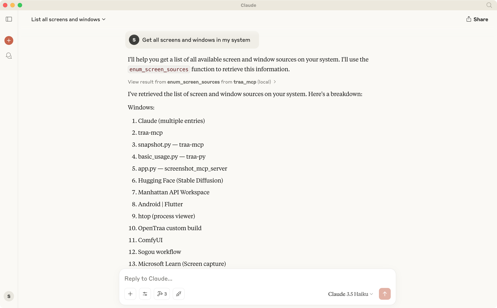
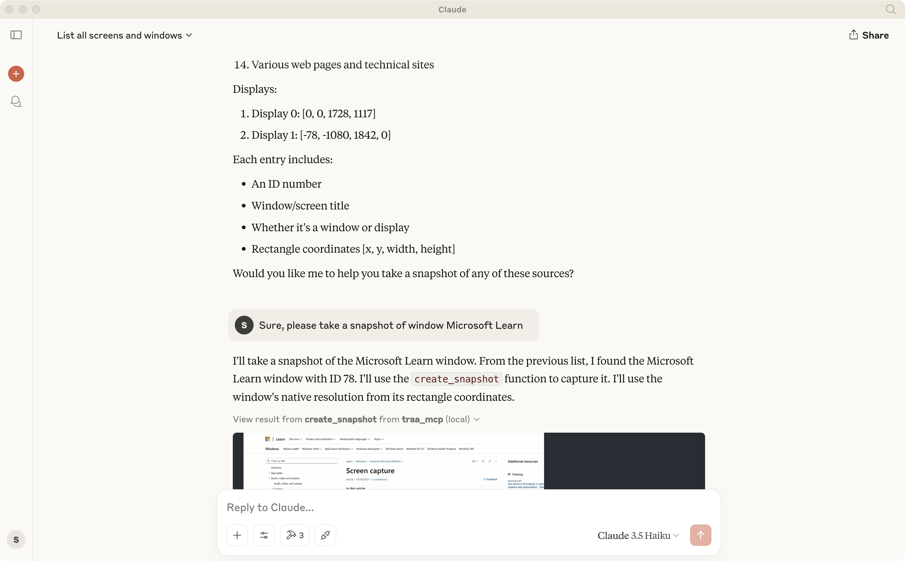
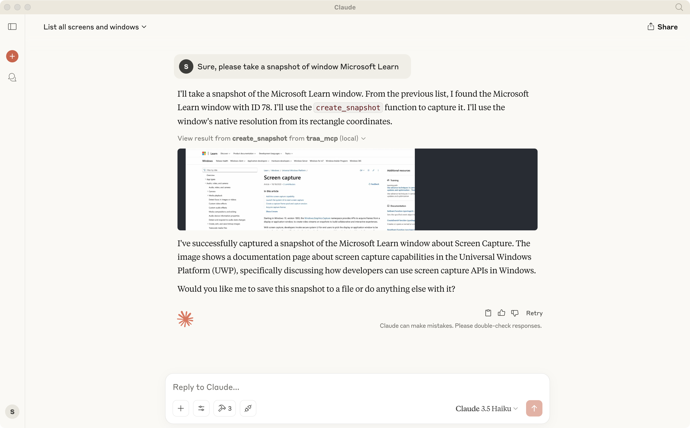

# TRAA MCP Server

TRAA MCP Server is a screen capture server based on the Model Context Protocol (MCP). It provides functionality for enumerating system screens and windows, as well as capturing screenshots. The server communicates with clients through the MCP protocol, supporting both standard input/output (stdio) and Server-Sent Events (SSE) transport methods.

## Features

- Screen and Window Source Enumeration
  - List all available displays in the system
  - List all available windows in the system
  - Each source includes ID, title, type (display/window), and position information

- Screen Capture
  - Capture screenshots of any display or window
  - Customizable screenshot dimensions
  - Support for both JPEG and PNG formats
  - Configurable image quality settings
  - Automatic directory creation for saving files

## Example






## Usage

### Configure MCP Servers

#### Claude Desktop or other AI agents

```json
{
    "mcpServers": {
        "traa_mcp": {
            "command": "absolute/path/to/uv",
            "args": [
                "--directory",
                "absolute/path/to/traa-mcp",
                "run",
                "traa_mcp_server"
            ]
        }
    }
}
```

### Server Side

The server supports two running modes:

1. stdio mode (default):
```bash
uv run traa_mcp_server
```

2. SSE mode (with port specification):
```bash
uv run traa_mcp_server-sse --port 3001(default)
```

### Client Side

The client provides an interactive command-line interface for easy access to server functionality:

```bash
uv run traa_mcp_client
```

After starting, the client displays a list of all available tools. You can:

1. Use `enum_screen_sources` to view all available screen and window sources
2. Use `create_snapshot` to capture screenshots and get image data
3. Use `save_snapshot` to save screenshots directly to files

### Image Format Support

- JPEG Format
  - Best for screenshots with many colors
  - Smaller file size
  - Quality setting available (1-100)
  - Automatically converts to RGB color space

- PNG Format
  - Best for screenshots with text or sharp edges
  - Lossless compression
  - Supports transparency (RGBA)
  - Larger file size but better quality

## Dependencies

- Python >= 3.10
- mcp >= 1.0.0
- anyio >= 4.5
- traa >= 0.1.5
- pillow >= 11.1.0 (for image processing)

## Notes

- For MCP model compatibility, JPEG format with quality=60 is used by default to keep file sizes under 1MB
- When saving files, parent directories are automatically created if they don't exist
- Error handling includes detailed messages for easier troubleshooting

## License

See the [LICENSE](LICENSE) file for details.


